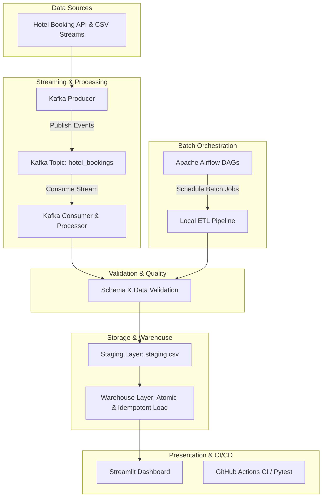

# 🏨 Hotel Booking Data Engineering Pipeline & Analytics Platform

[](https://github.com/Yazeen-Rizwan/hotel-booking-data-pipeline/actions/workflows/ci.yml)
[](https://www.python.org/)
[](https://airflow.apache.org/)
[](https://kafka.apache.org/)
[](https://www.docker.com/)
[](https://streamlit.io/)

A production-grade, end-to-end Data Engineering pipeline for real-time and batch processing of hotel booking events. This project demonstrates modern data engineering concepts including **ETL pipeline design**, **event streaming with Apache Kafka**, **orchestration with Apache Airflow**, **idempotent data warehouse loading**, **data validation**, **interactive analytics dashboards with Streamlit**, and **CI/CD automation with GitHub Actions**.

---

## 🏗️ Architecture & Pipeline Workflow



---

## 🔄 CI/CD and Version Control

### 1. Git Branching Strategy
This project follows a structured Git branching strategy tailored for data engineering teams:
- **`main`**: Production-ready, stable codebase. Direct commits to `main` are restricted.
- **`develop`**: Integration branch for combining tested features prior to release.
- **`feature/*`**: Feature branches for developing specific pipeline capabilities (e.g., `feature/cicd-testing`).
- **`fix/*`**: Dedicated branches for hotfixes and bug resolutions.

```text
  feature/cicd-testing  ───► [PR / CI Verification] ───┐
                                                       ▼
  develop  ───────────────────────────────────────► [Integration] ───► main (Production)
```

---

### 2. Pipeline as Code
All pipeline configurations, file path references, topic names, and infrastructure schemas are managed programmatically:
- **Configuration Module (`config/config.py`)**: Centralized management of dataset schemas (`REQUIRED_COLUMNS`), staging paths (`STAGING_FILE`), warehouse paths (`FINAL_DATA`), and Kafka broker parameters (`KAFKA_BROKER`).
- **Environment Independence**: Environment variables (`.env`) enable seamless execution across local development, testing, and cloud runtime environments without code modifications.

---

### 3. Unit Testing & Mock Testing
Automated unit testing validates the transformation logic, schema enforcement, and business rules without relying on live external infrastructure:
- **Transformation Unit Tests (`tests/tests_tranformations.py`)**: Validates missing value imputation, duplicate removal, schema validation, and edge case handling (empty DataFrames, boundary values).
- **Mock Testing (`tests/test_pipeline.py`)**: Utilizes `unittest.mock` (`@patch`) to simulate file system operations (`to_csv`, `read_csv`, `os.makedirs`) and Flask API endpoints (`/health`, `/bookings`). This ensures tests remain **deterministic, fast, and runnable locally** without creating physical file artifacts or network dependency locks.

---

### 4. GitHub Actions CI/CD Workflow
The continuous integration pipeline (`.github/workflows/ci.yml`) automates verification on every code contribution:
- **Triggers**: Automated runs on every `push` and `pull_request` targeting `main`, `master`, or `develop`.
- **Environment**: Ubuntu runner with Python 3.11.
- **Automated Steps**:
  1. Check out repository code (`actions/checkout@v4`).
  2. Set up Python 3.11 runtime (`actions/setup-python@v5`).
  3. Install dependencies from `requirements.txt` and `requirements-dev.txt`.
  4. Run the entire test suite (`python -m pytest tests/ -v`).
  5. Build fails automatically if any test fails, blocking unverified code from merging.

---

### 5. Basic Development Workflow
```text
Create Feature Branch ──► Develop Code & Write Tests ──► Run Local Pytest ──► Push & Open PR ──► GitHub Actions CI Pass ──► Merge to Develop/Main
```

---

## 🛠️ Commands Reference

### Installation & Local Setup
```bash
# Install core dependencies
pip install -r requirements.txt

# Install testing and development dependencies
pip install -r requirements-dev.txt
```

### Running Tests Locally
```bash
# Run complete test suite (Transformations + Mocked Pipeline + API)
python -m pytest tests/ -v

# Run transformation unit tests specifically
python -m pytest tests/tests_tranformations.py -v
```

### Running the Pipelines
```bash
# Run local batch ETL pipeline
python local_pipeline.py

# Launch Streamlit Analytics Dashboard
streamlit run dashboard.py
```

### Git Development Workflow Commands
```bash
# 1. Switch to develop and create a new feature branch
git checkout develop
git checkout -b feature/cicd-testing

# 2. Stage and commit changes
git add .
git commit -m "Add unit tests and CI workflow for transformation pipeline"

# 3. Push feature branch to GitHub
git push -u origin feature/cicd-testing
```

---

## 📁 Repository Structure

```text
├── .github/workflows/
│   └── ci.yml               # GitHub Actions CI workflow configuration
├── airflow/
│   └── dags/                # Apache Airflow DAG definitions
│       └── hotel_booking_pipeline.py
├── airflow_docker/          # Airflow container configuration & docker-compose
├── api/                     # Simulated API data source & endpoints
│   ├── app.py
│   └── hotel_bookings.csv
├── config/                  # Global pipeline configurations & schema rules
│   └── config.py
├── kafka_pipeline/          # Apache Kafka streaming Producer and Consumer
│   ├── producer.py
│   └── consumer.py
├── local_pipeline.py        # Core batch ETL execution script
├── replay/                  # Historical event streaming & replay utility
│   └── replay.py
├── staging/                 # Data staging layer
├── tests/                   # Test suite directory
│   ├── __init__.py
│   ├── tests_tranformations.py  # Data transformation unit tests
│   └── test_pipeline.py         # Mocked pipeline & API unit tests
├── validation/              # Data quality & schema validation modules
│   └── validation.py
├── warehouse/               # Atomic & Idempotent data warehouse loaders
│   ├── atomic_load.py
│   └── idempotent_load.py
├── dashboard.py             # Streamlit Interactive Analytics Dashboard
├── docker-compose.yml       # Docker Compose setup for infrastructure services
├── requirements.txt         # Production Python package dependencies
├── requirements-dev.txt     # Testing & development dependencies
└── .gitignore               # Environment & build artifact exclusion rules
```

---

## 📝 License & Author

- **Author**: Yazeen Rizwan
- **Repository**: [hotel-booking-data-pipeline](https://github.com/Yazeen-Rizwan/hotel-booking-data-pipeline.git)
