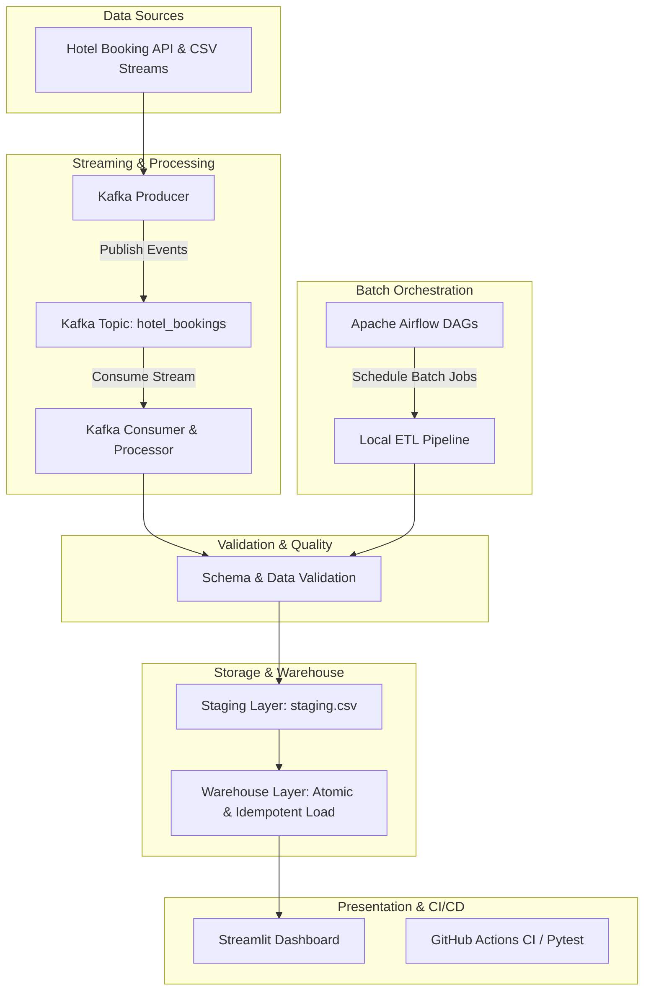

# 🏨 Hotel Booking Data Engineering Pipeline & Analytics Platform

[](https://github.com/Yazeen-Rizwan/hotel-booking-data-pipeline/actions/workflows/ci.yml)
[](https://www.python.org/)
[](https://airflow.apache.org/)
[](https://kafka.apache.org/)
[](https://www.docker.com/)
[](https://streamlit.io/)

A production-grade, end-to-end Data Engineering pipeline for real-time and batch processing of hotel booking events. This project demonstrates modern data engineering concepts including **ETL pipeline design**, **event streaming with Apache Kafka**, **orchestration with Apache Airflow**, **idempotent data warehouse loading**, **data validation**, **interactive analytics dashboards with Streamlit**, and **CI/CD automation with GitHub Actions**.

---

## 🏗️ Architecture & Pipeline Workflow



---

## ✨ Key Features

- **Batch & Real-Time Ingestion**: Supports historical event replay and real-time event streaming via Apache Kafka.
- **Robust Data Cleaning & Transformation**: Missing value imputation, record deduplication, and schema enforcement.
- **Atomic & Idempotent Warehouse Loading**: Guarantees data consistency, preventing partial writes or duplicate records upon retries.
- **Workflow Orchestration**: Scheduled Airflow DAGs orchestrate automated batch ETL runs.
- **Interactive Analytics Dashboard**: Streamlit dashboard presenting Average Daily Rate (ADR), cancellation rates, lead time distributions, and guest demographics.
- **Automated CI/CD**: GitHub Actions pipeline automatically triggers Pytest unit tests on every push and pull request.

---

## 📁 Repository Structure

```text
├── .github/workflows/
│   └── ci.yml               # GitHub Actions CI workflow configuration
├── airflow/
│   └── dags/                # Apache Airflow DAG definitions
│       └── hotel_booking_pipeline.py
├── airflow_docker/          # Airflow container configuration & docker-compose
├── api/                     # Simulated API data source & endpoints
│   ├── app.py
│   └── hotel_bookings.csv
├── config/                  # Global pipeline configurations & schema rules
├── kafka_pipeline/          # Apache Kafka streaming Producer and Consumer
│   ├── producer.py
│   └── consumer.py
├── local_pipeline.py        # Core batch ETL execution script
├── replay/                  # Historical event streaming & replay utility
│   └── replay.py
├── staging/                 # Data staging layer
├── tests/                   # Pytest unit tests for transformation & validation
│   └── tests_tranformations.py
├── validation/              # Data quality & schema validation modules
│   └── validation.py
├── warehouse/               # Atomic & Idempotent data warehouse loaders
│   ├── atomic_load.py
│   └── idempotent_load.py
├── dashboard.py             # Streamlit Interactive Analytics Dashboard
├── docker-compose.yml       # Docker Compose setup for infrastructure services
├── requirements.txt         # Python package dependencies
└── .gitignore               # Environment & build artifact exclusion rules
```

---

## 🚀 Quick Start Guide

### 1. Prerequisites
- Python 3.11+
- Docker & Docker Compose (for Airflow / Kafka infrastructure)

### 2. Environment Setup
Clone the repository and install required Python dependencies:

```bash
# Clone the repository
git clone https://github.com/Yazeen-Rizwan/hotel-booking-data-pipeline.git
cd hotel-booking-data-pipeline

# Create and activate virtual environment
python -m venv venv
source venv/bin/activate  # On Windows: venv\Scripts\activate

# Install dependencies
pip install -r requirements.txt
```

---

## 🧪 Running Unit Tests

To verify transformation logic and schema validation locally:

```bash
python -m pytest tests/tests_tranformations.py -v
```

Expected Output:
```text
tests/tests_tranformations.py::test_missing_values_are_filled PASSED     [ 25%]
tests/tests_tranformations.py::test_duplicate_records_are_removed PASSED [ 50%]
tests/tests_tranformations.py::test_valid_booking_schema PASSED          [ 75%]
tests/tests_tranformations.py::test_invalid_booking_schema PASSED        [100%]
======================== 4 passed in 0.80s ========================
```

---

## 📊 Running the Interactive Dashboard

Launch the Streamlit visualization interface:

```bash
streamlit run dashboard.py
```

Access the dashboard in your web browser at `http://localhost:8501`.

---

## ⚡ Running the Pipelines

### 1. Local Batch Pipeline
```bash
python local_pipeline.py
```

### 2. Kafka Event Streaming Pipeline
Start infrastructure services via Docker Compose:
```bash
docker-compose up -d
```

Run Kafka Producer and Consumer:
```bash
# Terminal 1: Start Consumer
python -m kafka_pipeline.consumer

# Terminal 2: Start Producer
python -m kafka_pipeline.producer
```

---

## 🔄 Continuous Integration (CI/CD)

This project uses **GitHub Actions** (`.github/workflows/ci.yml`) for automated continuous integration. On every `push` or `pull_request` to the `main` branch:

1. Code is checked out.
2. Python 3.11 environment is initialized.
3. Pipeline dependencies (`pandas`, `pytest`) are installed.
4. Transformation unit tests are executed automatically.

---

## 📝 License & Author

- **Author**: Yazeen Rizwan
- **Repository**: [hotel-booking-data-pipeline](https://github.com/Yazeen-Rizwan/hotel-booking-data-pipeline.git)
